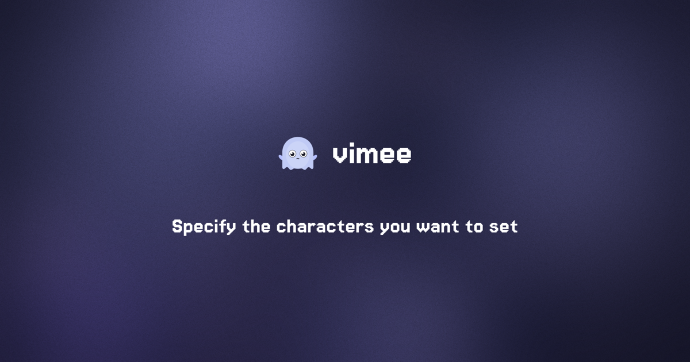

# opengraph

Procedural OGP image generator for vimee.



## How it works

Generates a 1200x630 OGP image with:

- **Procedural background** — Color blobs + gaussian blur create a unique gradient-mesh per input text
- **Deterministic** — Same text always produces the same image (FNV-1a hash → seed)
- **SVG icon** — `vimee.svg` is rasterized at runtime via [oksvg](https://github.com/srwiley/oksvg)
- **Film grain** — Multiplicative noise preserves hue
- **2x supersampling** — Renders at 2400x1260, downscales to 1200x630 with bilinear filtering

## Requirements

- Go 1.22+

## Usage

```sh
# Build
make build

# Generate with defaults
make generate

# Generate with custom text
make generate TITLE="My Project" SUBTITLE="A cool description"

# Or run directly
go run . "title" "subtitle"
go run . "title"  # subtitle is optional

# Clean up
make clean
```

## Output

`og.png` (1200x630 PNG) in the current directory.

## Customization

Edit constants in `main.go`:

| Constant | Description |
|---|---|
| `titleSize` / `subtitleSize` | Font sizes (at 2x resolution) |
| `blurR` | Gaussian blur radius for background |
| `numBlobs` | Number of color blobs |
| `grainDensity` | Fraction of pixels affected by grain (0.0-1.0) |
| `grainStrength` | Max noise percentage (+/-) |
| `palette` | Color palette for background blobs |

### Changing the font

Replace the embedded font file and update the `//go:embed` directive:

```go
//go:embed fonts/YourFont.ttf
var fontData []byte
```

### Changing the icon

Replace `vimee.svg` in the project root. The SVG is rasterized at runtime — no pre-conversion needed.

## Dependencies

- [fogleman/gg](https://github.com/fogleman/gg) — Text rendering
- [golang/freetype](https://github.com/golang/freetype) — TrueType font parsing
- [srwiley/oksvg](https://github.com/srwiley/oksvg) + [rasterx](https://github.com/srwiley/rasterx) — SVG rasterization
- [golang.org/x/image](https://pkg.go.dev/golang.org/x/image) — Bilinear downscaling
